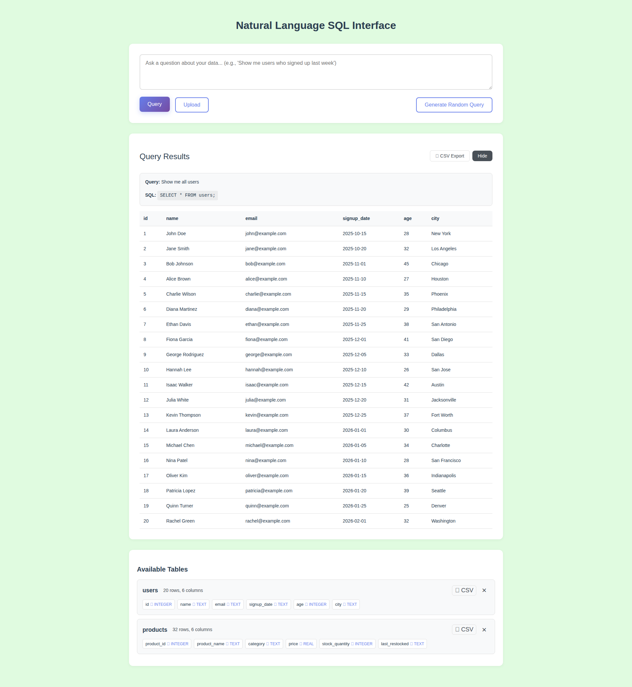

# Light Green Background Color Update

**ADW ID:** 3988f64c
**Date:** 2026-01-03
**Specification:** specs/issue-7-adw-3988f64c-sdlc_planner-background-color-update.md

## Overview

Updated the application's background color from light sky blue (#E0F6FF) to light green (#E0FBE0) to provide a fresh, calming appearance while maintaining excellent readability and visual hierarchy. This simple CSS variable change affects the entire application without modifying any functionality.

## Screenshots

## What Was Built

- Updated CSS background color variable from light sky blue to light green
- Verified color compatibility with existing UI components and text
- Maintained visual hierarchy and readability standards

## Technical Implementation

### Files Modified

- `app/client/src/style.css`: Changed `--background` CSS variable from `#E0F6FF` to `#E0FBE0` (line 9)

### Key Changes

- Single line CSS variable update: `--background: #E0FBE0;`
- The new light green color (#E0FBE0) matches the luminosity and saturation of the previous light sky blue
- Change is automatically applied across the entire application through the CSS variable system
- No other color variables required adjustment as they are designed to work with light backgrounds

## How to Use

No user action required. The light green background is automatically applied throughout the application:

1. The background color updates automatically when the application loads
2. All pages and components display the new light green background
3. All existing UI elements, text, and visual hierarchy remain fully functional

## Configuration

No configuration needed. The color is defined in the CSS variable system at `app/client/src/style.css:9`.

To change the background color in the future:
1. Open `app/client/src/style.css`
2. Modify the `--background` variable value
3. Rebuild the client application

## Testing

Validated through:
- Server tests: `cd app/server && uv run pytest`
- Client build: `cd app/client && npm run build`
- Visual confirmation via Playwright screenshots showing the light green background applied correctly

## Notes

- The light green color (#E0FBE0) was specifically chosen to match the luminosity and saturation of the previous light sky blue
- This is a purely visual change with zero functional modifications
- The CSS variable system makes background color changes simple and maintainable
- All text colors and UI components work correctly with the new background without requiring adjustment
