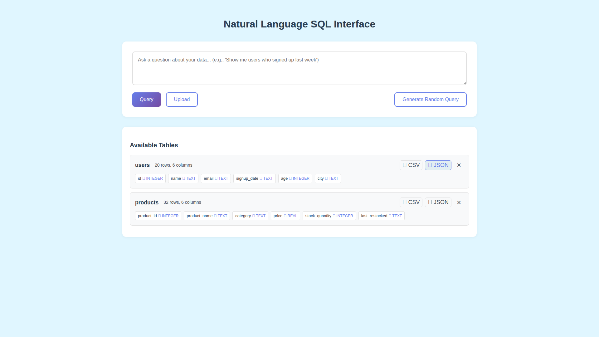

# JSON Export Functionality

**ADW ID:** c737436e
**Date:** 2026-01-02
**Specification:** specs/issue-2-adw-c737436e-sdlc_planner-add-json-export.md

## Overview

Added comprehensive JSON export functionality for database tables and query results, providing a parallel export system alongside the existing CSV export capability. This feature enables users to download data in JSON format with a single click, maintaining proper data types and UTF-8 encoding for seamless integration with modern APIs, web applications, and data pipelines.

## Screenshots


*JSON export buttons positioned next to CSV export buttons on table headers*


*JSON export option available for query results alongside CSV export*


*Complete implementation showing both table and query JSON exports functioning*

## What Was Built

- JSON export utility functions in `export_utils.py` for converting data and tables to JSON format
- Two new API endpoints: `/api/export/table-json` and `/api/export/query-json`
- Client-side API methods: `exportTableJson()` and `exportQueryResultsJson()`
- UI buttons for JSON export on both table headers and query results
- Comprehensive unit tests for JSON export functionality (219 lines added to test suite)
- E2E test specification for validating JSON export workflow

## Technical Implementation

### Files Modified

- `app/server/core/export_utils.py`: Added `generate_json_from_data()` and `generate_json_from_table()` functions using pandas DataFrame with proper JSON serialization
- `app/server/server.py`: Added `/api/export/table-json` and `/api/export/query-json` POST endpoints with security validation
- `app/client/src/api/client.ts`: Added `exportTableJson()` and `exportQueryResultsJson()` methods with blob download handling
- `app/client/src/main.ts`: Added JSON export buttons (📋 JSON icon) next to existing CSV export buttons for both tables and query results
- `app/server/tests/test_export_utils.py`: Added comprehensive `TestJsonExportUtils` class with 9 test methods covering various scenarios

### Key Changes

- **Server-side JSON generation**: Leverages pandas `to_json()` method with `orient='records'` for array-of-objects format, `indent=2` for readability, and `force_ascii=False` for proper Unicode handling
- **Data type preservation**: JSON maintains proper types (integers remain integers, floats remain floats, booleans remain booleans, None becomes null)
- **Security validation**: Reuses existing `validate_identifier()` and `check_table_exists()` functions to prevent SQL injection
- **Consistent architecture**: Mirrors CSV export implementation pattern for maintainability
- **UI integration**: JSON buttons use 📋 icon to distinguish from CSV (📊), positioned consistently next to CSV buttons

## How to Use

### Exporting a Table as JSON

1. Navigate to the application with loaded tables
2. Locate the table you want to export in the tables list
3. Click the "📋 JSON" button on the table header (next to the CSV button)
4. The browser will download a file named `{tablename}_export.json`
5. The JSON file contains an array of objects with proper data types preserved

### Exporting Query Results as JSON

1. Execute a SQL query in the query input area
2. View the results displayed in the results table
3. Click the "📋 JSON Export" button in the results header
4. The browser will download a file named `query_results.json`
5. The JSON file contains an array of objects representing the query results

### JSON Format

The exported JSON follows this structure:
```json
[
  {
    "column1": "value1",
    "column2": 123,
    "column3": true,
    "column4": null
  },
  {
    "column1": "value2",
    "column2": 456,
    "column3": false,
    "column4": "data"
  }
]
```

Empty results produce a valid empty array: `[]`

## Configuration

No additional configuration required. The feature uses:
- Python's built-in `json` module (no new dependencies)
- Existing pandas library for data handling
- Same security validation as CSV export
- UTF-8 encoding by default

## Testing

### Unit Tests

Run JSON export unit tests:
```bash
cd app/server && uv run pytest tests/test_export_utils.py::TestJsonExportUtils -v
```

Run all server tests:
```bash
cd app/server && uv run pytest
```

### E2E Testing

Execute the E2E test specification:
```bash
# Read and execute the E2E test
cat .claude/commands/e2e/test_json_export_functionality.md
```

The E2E test validates:
- JSON export buttons appear correctly in UI
- Files download with correct names (`{table}_export.json`, `query_results.json`)
- JSON structure is valid and parseable
- Data types are properly preserved
- Special characters and Unicode handled correctly
- Empty results produce valid empty JSON arrays

### Manual Testing

1. Load sample data into tables
2. Test table JSON export and verify downloaded file
3. Execute various queries (simple, complex, empty results)
4. Test query results JSON export
5. Verify CSV export still works (regression testing)
6. Test with special characters, Unicode, and edge cases

## Notes

- **No new dependencies**: Uses Python's built-in `json` module and existing pandas library
- **Architecture consistency**: Follows exact pattern of CSV export for easy maintenance
- **Data type preservation**: Unlike CSV, JSON maintains proper types (numbers stay numbers, not strings)
- **UTF-8 encoding**: Properly handles Unicode characters, emojis, and special characters
- **Security**: Uses same validation as CSV export to prevent SQL injection
- **Format flexibility**: Users can now choose between CSV (for spreadsheets) and JSON (for APIs/web apps)
- **Performance**: Efficiently handles large datasets using pandas DataFrame operations
- **Browser compatibility**: Uses same blob download mechanism as CSV export
- **Future extensibility**: The pattern established can be extended for XML, Excel, or other export formats
