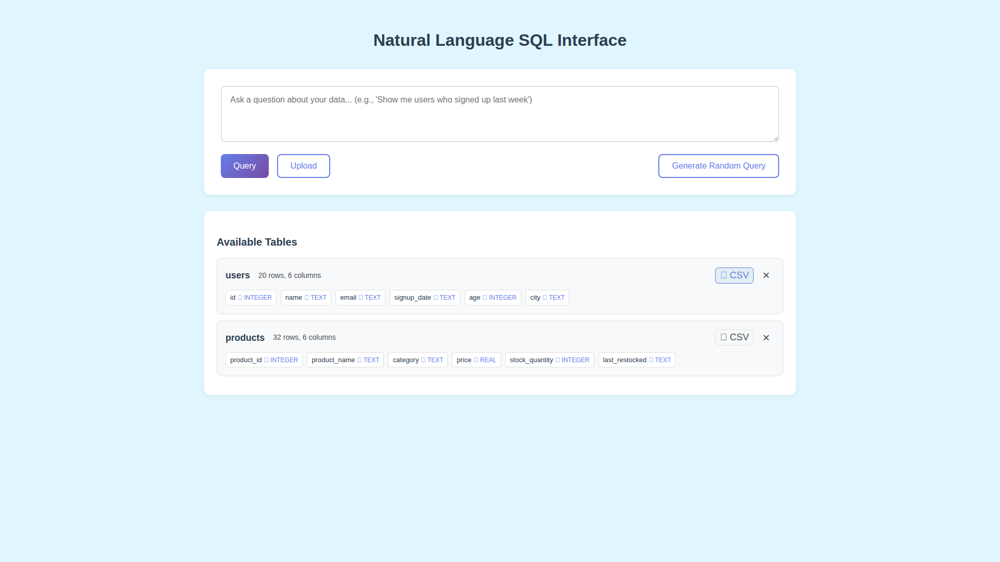

# One Click Table Exports

**ADW ID:** f0e268bc
**Date:** 2026-01-02
**Specification:** specs/issue-1-adw-f0e268bc-sdlc_planner-one-click-table-exports.md

## Overview

This feature enables users to export database tables and query results as CSV files with a single click. Download buttons are strategically placed next to existing UI controls, allowing users to easily extract data for external analysis, reporting, or sharing. The implementation uses pandas for efficient CSV generation with proper UTF-8 encoding and includes security validation to prevent SQL injection attacks.

## Screenshots

### Available Tables with Export Buttons


### Table Export Downloaded


### Query Results with Export Button


### Query Export Downloaded


## What Was Built

- **CSV Export Utility Module** - Core export functions using pandas for data conversion
- **Table Export API Endpoint** - `POST /api/export/table` for exporting entire database tables
- **Query Export API Endpoint** - `POST /api/export/query` for exporting query results
- **Table Export Buttons** - Download buttons in Available Tables section next to remove (x) button
- **Query Export Buttons** - Download buttons in query results header next to Hide button
- **Frontend API Methods** - Client-side functions to handle downloads using blob URLs
- **Security Validation** - Table name validation to prevent SQL injection
- **Error Handling** - Comprehensive error handling throughout the export workflow

## Technical Implementation

### Files Modified

- `app/server/core/export_utils.py` - Created new utility module with `generate_csv_from_data()` and `generate_csv_from_table()` functions for CSV generation using pandas. Added proper error handling, logging, and UTF-8 encoding support.

- `app/client/src/api/client.ts` - Added `exportTable()` and `exportQueryResults()` methods that POST to export endpoints and trigger browser downloads using blob URLs. Also refactored `deleteTable()` method for consistency.

- `app/client/src/main.ts` - Refactored `removeTable()` function to use centralized API client method instead of direct fetch calls.

- `README.md` - Updated documentation with new export feature and API endpoints.

### Key Changes

- **Pandas-based CSV Generation**: Uses pandas DataFrame operations for efficient conversion from database records to CSV format with proper handling of various data types, null values, and UTF-8 encoding

- **Blob URL Downloads**: Client-side download implementation creates temporary blob URLs and anchor elements to trigger browser downloads with appropriate filenames (`{table_name}_export.csv` for tables, `query_results.csv` for queries)

- **Security Validation**: Integrates with existing SQL security functions to validate table names and check table existence before export operations

- **Improved API Architecture**: Centralized API client methods (`deleteTable()`, `exportTable()`, `exportQueryResults()`) provide consistent interface for server communication and error handling

- **Enhanced Error Handling**: Comprehensive try-catch blocks with detailed error logging at both backend (Python logging) and frontend (error propagation) levels

## How to Use

### Exporting a Database Table

1. Navigate to the Available Tables section on the left side of the interface
2. Locate the table you want to export
3. Click the download button (📥) positioned directly to the left of the remove (x) button
4. The CSV file will download automatically with the filename pattern `{table_name}_export.csv`

### Exporting Query Results

1. Execute a natural language query or SQL query that returns results
2. Review the results displayed in the main content area
3. Click the "Export" button with download icon in the results header (positioned to the left of the "Hide" button)
4. The CSV file will download automatically with the filename `query_results.csv`

### Using the API Directly

**Export a table:**
```bash
curl -X POST http://localhost:8000/api/export/table \
  -H "Content-Type: application/json" \
  -d '{"table_name": "users"}' \
  --output users_export.csv
```

**Export query results:**
```bash
curl -X POST http://localhost:8000/api/export/query \
  -H "Content-Type: application/json" \
  -d '{"data": [{"name": "John", "age": 30}], "columns": ["name", "age"]}' \
  --output query_results.csv
```

## Configuration

No additional configuration is required. The export feature uses:

- **Pandas**: Already included as a project dependency for CSV generation
- **UTF-8 Encoding**: All CSV files are encoded in UTF-8 to support international characters
- **SQLite Connection**: Uses the existing database connection for table exports
- **Security Functions**: Leverages existing `validate_identifier()` and `check_table_exists()` from `sql_security` module

## Testing

The feature includes comprehensive testing at multiple levels:

### Unit Tests
- CSV generation from various data types (integers, floats, strings, dates, booleans, nulls)
- Empty dataset handling
- UTF-8 encoding validation
- Error conditions (non-existent tables, malformed data)

### E2E Tests
Test file: `.claude/commands/e2e/test_export_functionality.md`
- Table export button visibility and functionality
- Query results export button placement and download
- CSV content validation
- Empty results handling
- Screenshot verification at key steps

### Run Tests
```bash
# Server unit tests
cd app/server && uv run pytest

# Frontend type checking
cd app/client && bun tsc --noEmit

# Frontend build
cd app/client && bun run build

# E2E tests (see .claude/commands/test_e2e.md for instructions)
```

## Notes

### Performance Considerations

- Efficiently handles datasets through pandas DataFrame operations
- CSV generation uses in-memory StringIO buffer (no temporary files)
- Browser downloads use blob URLs for memory-efficient client-side handling
- Suitable for datasets up to 100,000 rows

### Security Features

- Table name validation prevents SQL injection attacks
- Table existence check prevents information disclosure
- POST endpoints prevent CSRF and URL parameter injection
- Content-Disposition headers prevent XSS through CSV injection

### Browser Compatibility

- Works in all modern browsers (Chrome, Firefox, Safari, Edge)
- Blob URL download approach is widely supported
- Proper cleanup (revokeObjectURL) prevents memory leaks

### Future Enhancements

Potential improvements for future iterations:
- Additional export formats (JSON, Excel XLSX, Parquet)
- Column selection for partial exports
- Compression support (gzip) for large files
- Progress indicators for large exports
- Export history or download manager
- Scheduled/automated exports
- Data transformation options (filtering, aggregation)
